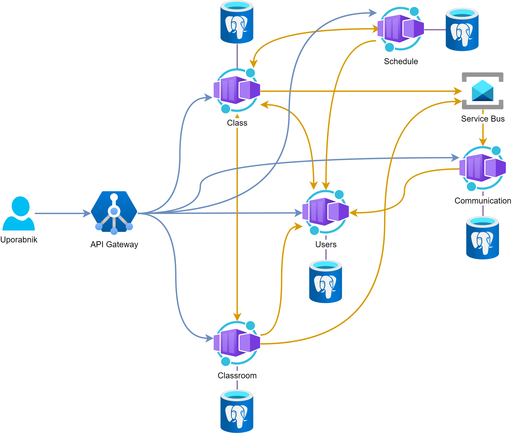

> Projektna naloga za Računalniške storitve v oblaku (UL FRI)

Razvijamo spletno platformo namenjeno za vzgojno-izobraževalne inštitucije - **Magisterium**.
Cilj je podpirati vse vzgojno-izobraževalne aktivnosti od beleženja ocen ter vedenja do komunikacije med posameznimi akterji - profesorji, učenci in starši.
Trenutno je na Slovenskem trgu samo en konkurenčni produkt, ki ponuja pomanjkljive funkcionalnosti.

# Primeri uporabe

- **Prijava**: Uporabnik se prijavi.
- **Sporočanje**: Uporabnik lahko pregleduje in pošilja sporočila.
- **Ocenjevanje**: Profesor lahko vnese ocene za svoj predmet, učenec pa ima vpogled v svoje ocene pri vsakem predmetu.
- **Urnik**: Šola lahko vnese urnik, kjer si učenci in učitelji lahko ogledajo prihajajoče obveznosti.
- **Sprotno delo**: Profesor lahko vnese sprotno delo na svojem predmetu ter ga po oddaji oceni. Učenci lahko pregledujejo svoje sprotne obveznosti.
- **Spletna učilnica**: Profesor lahko objavi učno gradivo za svoje učence.
- **Forum**: Omogoča odprto komunikacijo vseh udeležencev danega predmeta.

\pagebreak

# Shema arhitekture

# Osnutek mikrostoritev

## Uporabniki (*Users*)

Storitev upravlja z identitetami akterjev, ki so deljene po najemnikih (*angl. tenant*).
Za vsak tip identitete (profesor, učenec, starš) hrani relevantne informacije kot so ime, priimek, državna identifikacija, kraj bivanja ...
Implementira tudi avtentikacijske mehanizme.

## Predmet (*Class*)

Storitev upravlja s predmeti, ki se poučujejo.
Beleži nosilca/e predmeta, udeležence, redovalnico/indeks, sprotno delo ...

## Urnik (*Schedule*)

Storitev upravlja s časovno porazdelitvijo predmetov ter drugimi dogodki.

## Komunikacija (*Communication*)

Skrbi za pošiljanje in dostavo sporočil po različnih kanalih - interno, email, sms ...

## Spletna učilnica (*Classroom*)

Storitev upravlja z izobraževalnim gradivom predmeta in forumom za skupno komunikacijo vseh udeležencev.

# Razvojno okolje

- Oblačna infrastruktura: Azure
- Orkestracija: Kubernetes
- Čelni del: Node.js, Nuxt (Vue.js), tailwindcss
- Zaledni del: Go (go-micro), Java (KumuluzEE), REST, GraphQL, AMQP (RabbitMQ), gRPC
- Podatkovna baza: PostgreSQL, Redis
- Razvojno okolje: VisualStudio Code, IntelliJ Idea, DBeaver, Insomnia/Postman
