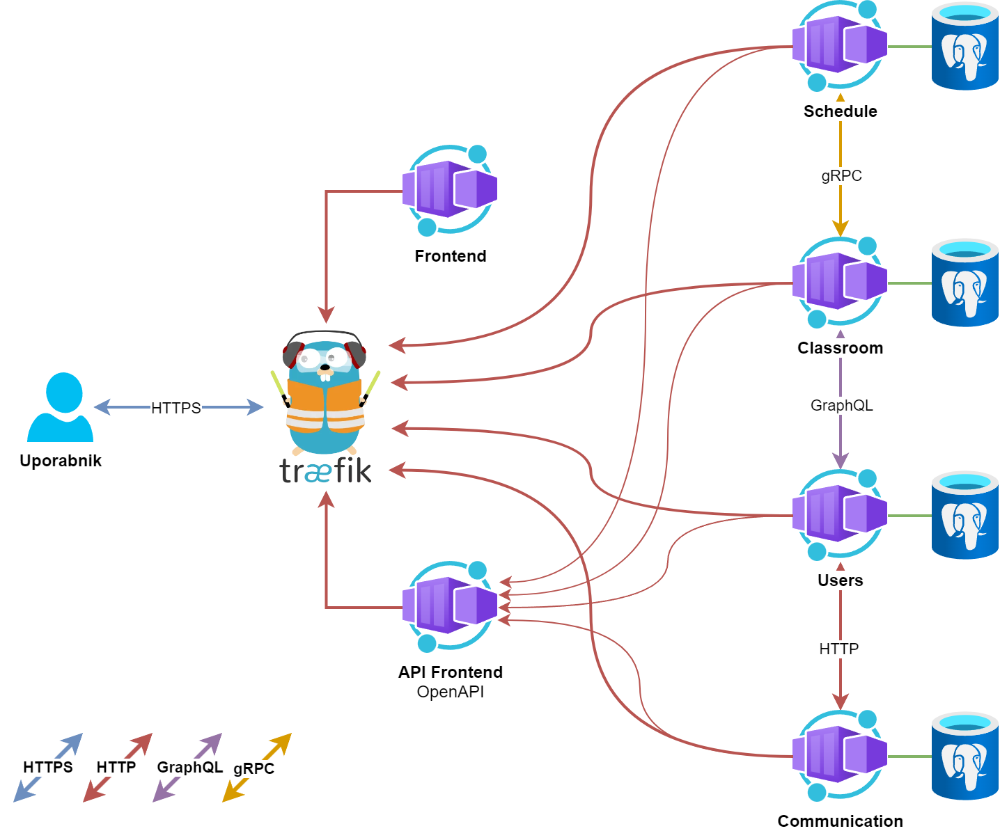

> Projektna naloga za Računalniške storitve v oblaku (UL FRI)

# GitHub povezava do projekta

https://github.com/rso-magisterium/

# URL povezava do aplikacije

https://magisterium.works/

Račun za prijavo:

- e-mail: test@example.com
- geslo: tester1234

# Opis projekta

Razvila sva spletno platformo namenjeno za vzgojno-izobraževalne inštitucije - **Magisterium**. 
Motivacija za projekt so bile slabe izkušnje z podobnimi platformami, kot npr. Moodle ter eAsistent. 
Najin projekt ponuja alternativo tema dvema velikanoma vzogjo-izobraževalnih inštitucij ter združuje njuno funkcionalnost v eno celoto, 
obenem pa ponuja lahko fleksibilno skaliranje glede na potrebe uporabnikov.
V trenutnem stanju najina platforma podpira nekaj vzgojno-izobraževalnih aktivnosti - komunikacijo z uporabniki, urnik, spletno učilnico ter forum. 

# Ogrodje in razvojno okolje 

Za čelni del sva se odločila za uporabo razvojnih okolij IntelliJ Idea Ultimate ter VisualStudio Code.
Za testiranje API klicev sva uporabila odprtokodno orodje Insomnia.

Čelni del je napisan v ogrodju Nuxt, za poganjanje uporabniškega vmesnika sva uporabila okolje Node.js. 
Za olepšavo aplikacije sva uporabila Tailwind CSS, za izvanaje API klicev pa axiom.

# Shema arhitekture

\pagebreak

# Seznam funkcionalnost mikrostoritev

## Uporabniki (*Users*)

Storitev upravlja z identitetami akterjev, ki so deljene po najemnikih (*angl. tenant*).
Za vsak tip identitete (profesor, učenec) hrani ime, e-poštni naslov ter ali je uporabnik administrator.
Implementira avtentikacijo z e-poštnim naslovom ter SSO - preko spletnega portala GitHub.

Povzeti API klici:
- */api/auth/\** - Klici namenjeni prijavi, odjavi ter registraciji uporabnika
- */api/tenant\** - Klici za upravljanje najenmikov
- */api/user/\** - Klici namenjeni za pridobivanje podatkov o uporabniku

## Predmet (*Classroom*)

Storitev upravlja s predmeti, ki se poučujejo.
Beleži nosilca/e predmeta, udeležence, vsebino spletne strani ter forum za javno komunikacijo med udeleženci predmeta.

Povzeti API klici:
- */api/classroom/\** - Klici za pridobitev ter posodabljanje podatkov z učilnice

## Urnik (*Schedule*)

Storitev upravlja s časovno porazdelitvijo predmetov ter drugimi dogodki.

Povzeti API klici:
- */api/schedule/{tenantId}* - Klic za pridobitev uporabnikovega urnika

## Komunikacija (*Messaging*)

Skrbi za pošiljanje in dostavo sporočil med udeleženci.

- */api/contacts/{tenantId}* - Uporabniku vrne kontakte iz najemnika
- */api/message/\** - Skrbi za pošiljanje ter prejemanje sporočil

# Primeri uporabe

- **Prijava**: Uporabnik se prijavi.
- **Sporočanje**: Uporabnik lahko pregleduje in pošilja sporočila.
- **Urnik**: Šola lahko vnese urnik, kjer si učenci in učitelji lahko ogledajo prihajajoče obveznosti.
- **Spletna učilnica**: Profesor lahko objavi učno gradivo za svoje učence.
- **Forum**: Omogoča odprto komunikacijo vseh udeležencev danega predmeta.

Bolj kompleksen primer uporabe bi bil komunikacija z učiteljem. Uporabnik se mora najprej prijaviti, kjer sodeluje uporabniška mikrostoritev. Nato uporabnika preusmeri na domačo stran, kjer urnikova mikrostoritev naloži urnik. Sledi navigacija na stran klepeta, kjer komunikacijska mikrostoritev naloži kontakte ter sporočila, na koncu pa še pošlje uporabnikovo sporočilo.

Najina storitev je primerna za raznovrste izobraževalne ustanove, saj lahko zaradi lahke skalibilnosti hitro prilagodimo vire naše aplikacije ter tako in znižamo stroške šoli, prav tako pa ponujamo veliko dostopnost virov na primer pred izpitnim obdobjem, ko bi bila naša platforma bolj obremenjena.

# Razvojno okolje

- Oblačna infrastruktura: Azure
- Orkestracija: Kubernetes
- Zaledni del: Go (go-micro), Java (KumuluzEE), REST, GraphQL, AMQP (RabbitMQ), gRPC
- Podatkovna baza: PostgreSQL, Redis
- Razvojno okolje: VisualStudio Code, IntelliJ Idea, DBeaver, Insomnia/Postman
